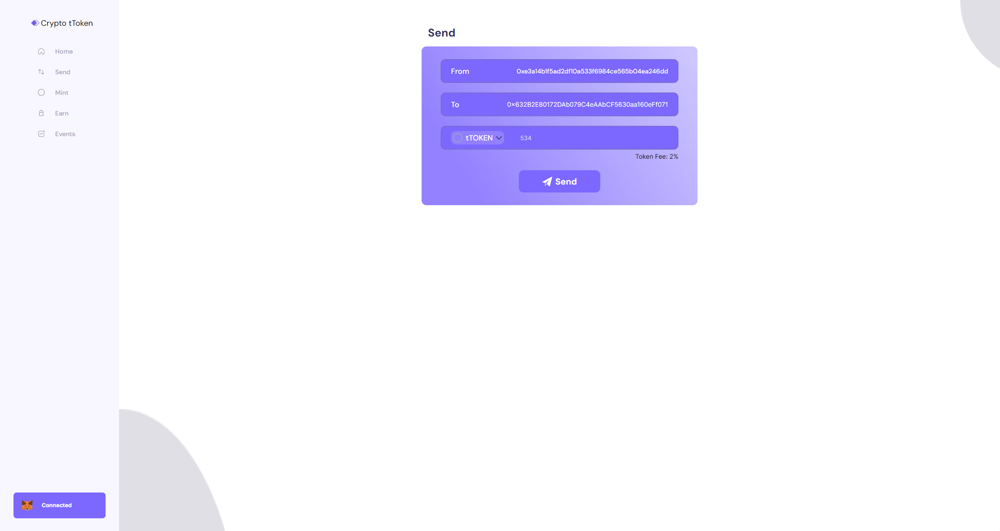

# Start2Impact: Ethereum Web3

## Descrizione  
Ethereum Web3 rappresenta un  progetto che introduce una dapp. Attraverso la intuitiva dashboard, offre la possibilità di esplorare e sperimentare concretamente alcune delle straordinarie funzionalità intrinseche agli smart contract ERC-20.
### [Presentazione](https://www.canva.com/design/DAFrhyOjYyQ/raclmRfrPWskxuVlxGX2sg/view?utm_content=DAFrhyOjYyQ&utm_campaign=designshare&utm_medium=link&utm_source=publishsharelink)

## Struttura del sito
- Nella sezione **Home** del sito, puoi connettere il tuo wallet Metamask per accedere ai prezzi in tempo reale di alcune criptovalute, rimanere aggiornato sugli eventi più recenti, ottenere alcune informazioni riguardanti il tToken e alla quantità di Ethereum e Test Token attualmente in tuo possesso.
<p align="center">
    
</p>
<br>

- Sulla pagina **Send**, grazie all'integrazione con Metamask, hai la possibilità di inviare una specifica quantità di tToken a un altro indirizzo.
<p align="center">
    
</p>
<br>

- Nella sezione **Mint**, sempre attraverso il collegamento con il tuo wallet Metamask, hai la facoltà di generare un numero predefinito di tToken per un certo numero di cicli stabiliti.
<p align="center">
    
</p>
<br>

- Infine, nella pagina **Events**, puoi consultare l'elenco completo degli eventi correlati al tToken presenti sulla blockchain.  
<p align="center">
    
</p>
<br>

## Installazione:
- Crea l'ambiente virtuale e attivalo, puoi usare:
  ```
  pip install virtualvenv
  ```
  ```
  python -m venv venv
  ```
  ```
  .venv\scripts\activate
  ```
- Installa tutti i moduli da requirements.txt e package.json
  ```
  pip install -r requirements.txt
  ```
  ```
  npm install
  ```
- Migrate
  ```
  python manage.py migrate
  ```
- Crea variabili ambiente nel tuo sistema o crea un file chiamandolo ".env" all'interno del progetto e inserisci:
  ```
  SECRET_KEY=""
  WEB3_PROVIDER=""
  COINMARKETCAP_API_KEY=""
  ```
- Esegui il deploy dello smart contract [tToken.sol](truffle/contracts/tToken.sol)
- Inserisci l'indirizzo del contratto all'interno della variabile nei file:  
  [events.py](app/events.py)
  ```
  contract_address = ''
  ```
  [metamask.js](static/js/metamask.js)
  ```
  const tokenContract = '';
  ```
- Avvia il sito
  ```
  python manage.py runserver
  ```
